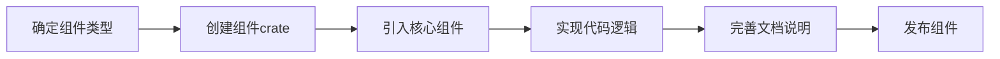

# lego-os 见证组件化的力量

    探索使用Rust语言、并以组件化的开发方式构建OS 

## 简介

`Lego`即乐高，`lego-os`致力于探索使用 Rust 语言编写操作系统，并以组件化的方式进行开发。

- `lego-os` 的内核及所有组件均采用 Rust 语言实现，充分发挥现代高级语言在生产力、可靠性和安全性上的优势。
- 通过组件化的架构设计，与传统的大型软件如 Linux、U-Boot 等相比，`lego-os` 能够显著减少内核代码量，规范文档以及代码注释，降低团队协作的复杂性。

`lego-os` 项目为探索**新型底层开发语言 Rust**与**新型内核开发方法**提供了一个实践平台，同时也为操作系统内核开发的学者与爱好者提供了宝贵的学习与研究途径。

我们希望，基于 `lego-os` 核心组件开发的模块，不仅能用于构建操作系统，还可以延伸至固件或 Bootloader 等裸机应用的开发。

## 背景描述

### Rust vs C

Rust 是一种新兴的高级编程语言，具有更高的开发效率和生产力。与 C 语言相比，Rust 在安全性、性能以及开发体验等方面具备显著优势。目前，Rust 已被众多知名企业广泛采用，并且其受欢迎程度持续上升。

<table>
  <thead>
    <tr>
      <th></th>
      <th>Rust</th>
      <th>C</th>
    </tr>
  </thead>
  <tbody>
    <tr>
      <td>内存安全性</td>
      <td>所有权、生命周期，一定程度上避免人为的内存安全问题</td>
      <td>手动管理内存，容易出现内存安全问题</td>
    </tr>
    <tr>
      <td>面向过程</td>
      <td>支持</td>
      <td>支持</td>
    </tr>
    <tr>
      <td>面向对象</td>
      <td>支持</td>
      <td>不支持</td>
    </tr>
    <tr>
      <td>包管理</td>
      <td>统一Cargo</td>
      <td>复杂多样</td>
    </tr>
    <tr>
      <td>泛型</td>
      <td>支持</td>
      <td>弱泛型支持</td>
    </tr><tr>
      <td>文档说明</td>
      <td>Cargo doc一键生成文档</td>
      <td>很多软件文档说明不规范、不统一、甚至不完全</td>
    </tr>
    <tr>
      <td>项目构建</td>
      <td>方便统一Cargo</td>
      <td>复杂多样 Make、Cmake、Ninja……</td>
    </tr>
  </tbody>
</table>

### 项目组织 —— 单体结构 vs 组件化结构

许多优秀的大型底层软件，尤其是用C语言开发的，大多将代码存储在一个仓库中，这种组织方式可能存在一些问题，例如：

- 代码耦合性高：：由于所有功能模块都在同一个仓库中，模块之间的依赖和耦合可能变得较为紧密，如果某个模块需要修改，可能会影响到其他模块的正常运行。
- 权限与访问控制困难：共享同一个仓库意味着所有开发者都可以访问整个代码库，这在某些情况下可能会带来安全问题。
- 版本控制复杂：当所有功能模块都在同一个仓库中时，版本控制变得更加复杂。每次提交、分支或合并都可能涉及大量的代码修改，影响到整个项目的稳定性。
- 构建与编译效率低：单一仓库的代码量较大，构建过程可能会非常耗时。即使修改的是一个小模块，也可能需要重新构建整个项目，这在大型项目中会大大降低开发效率，尤其在构建系统不够高效的情况下。
-  团队协作冲突：在单一仓库中，多个开发者同时处理不同模块的功能时，可能会发生频繁的代码冲突。尤其是在团队较大时，协调不同模块的开发变得更加困难，可能导致工作效率下降。
- 开发者学习曲线陡峭：对于新加入的开发者来说，了解整个仓库的结构和各模块之间的复杂关系可能需要较长的时间。
- 测试和部署困难：尽管可以为不同模块设置单元测试，但在一个大仓库中进行全局集成测试和部署会更加困难，任何一个模块的错误都可能影响整个系统的稳定性。

**组件化开发方式通过将操作系统的功能模块划分为多个独立的组件来实现。每个组件对应一个功能模块，组件中定义了一组接口供开发者使用和实现，从而实现灵活轻便的组件化开发。** 我们借用此种开发方式来缓解上述的问题。

## 开发方式

`lego-os` 提供了一系列核心组件，这些组件针对操作系统的各个功能模块进行了分类抽象。有的提供功能接口，有的则是实用工具。借助这些核心组件，开发者可以根据需求灵活开发特定的组件。

核心组件如下：

- lego_arch：与架构相关的功能，包括寄存器操作、特殊指令、trap处理
- lego_mem：内存分配器接口、虚拟物理内存映射接口
- lego_virt：虚拟化
- lego_timer：定时器、计时器接口
- lego_process：进程管理、进程调度接口
- lego_net：网络协议栈接口
- lego_io：阻塞、非阻塞、异步IO模型接口
- lego_fs：虚拟文件系统接口
- lego_device：设备驱动接口

组件的开发流程大致如上：

1. 按照需要开发的组件，确定组件的类型，例如：一个设备驱动程序、一个内存分配算法、一个进程调度算法
2. 使用Rust Cargo为将要开发的组件创建独立的crate
3. 根据组件的类型，在crate中引入核心组件`lego_*`依赖，按需开启features
4. 使用核心组件提供的工具或接口，实现组件的代码逻辑
5. 为了其他开发者的学习和使用，须完善该组件的文档说明
6. 发布组件，可以供其他开发者复用组件

## 文档说明

快速体验组件化的力量：[quick-start](../quick_start.md)

核心组件说明：[core-components](../core-components.md)

其它组件：[components](../components.md)

## 见证lego-os

`lego-os`的发展离不开您的参与！无论您对操作系统内核开发充满兴趣，还是在某些功能组件上拥有丰富经验，无论您是学术研究者还是软件开发者，我们都真诚地欢迎您的加入，共同推动项目壮大与进步。

联系方式：`email: 18304935041@163.com qq: 2925212608`

