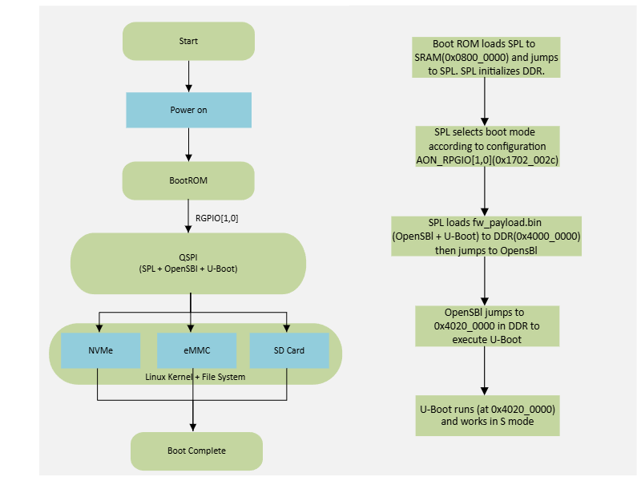
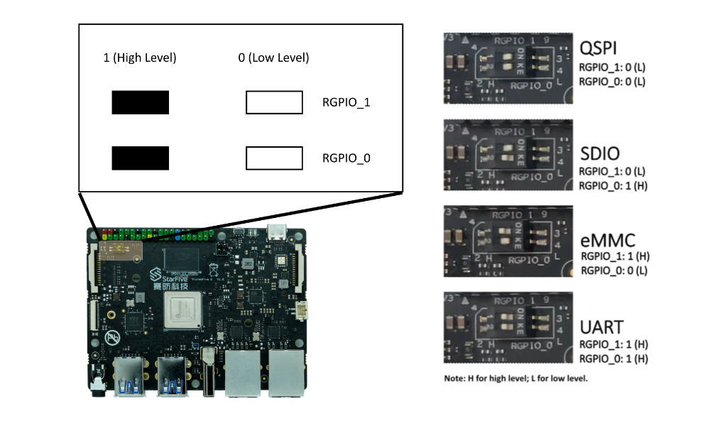
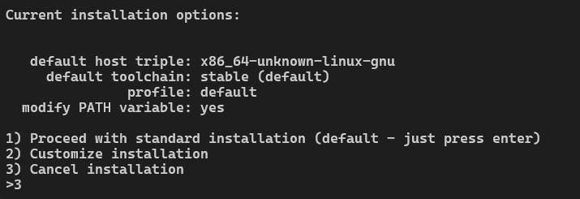
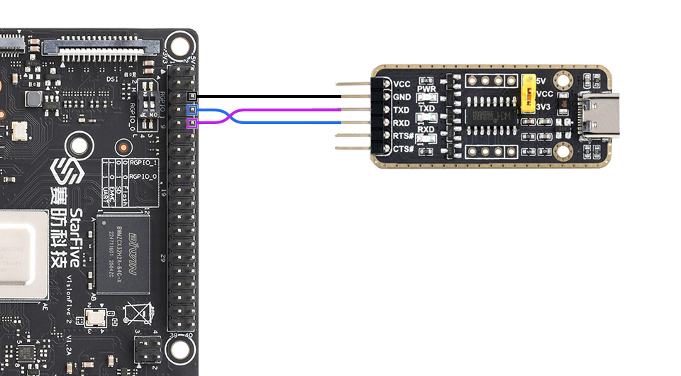

# 快速体验

本文介绍如何使用我们开发的`vf2_firmware`固件代替uboot固件，在Visionfive2平台上运行。

预先准备环境：

- Visionfive2 主板
- 一台Linux主机或虚拟机（能够读写SD卡）
- riscv工具链（unknow-none）
- Rust语言环境
- Uart USB转TTL（或其他可以连接uart的设备）

## VisionFive 2 及启动流程

VisionFive 2是一款搭载RISC-V处理器的单板计算机，它拥有一个采用RV64GC ISA的四核64位SoC，运行速度高达1.5 GHz，提供了丰富的外设。

VisionFive2 的启动流程为 `BootROM > SPL + Open SBI + UBoot > Kernel + File System > Boot Complete`。其中BootROM为片上内存，spl是Uboot的一部分，OpenSBI编译后同UBoot链接在一起，启动过程如下图所示：



加电后，第一步是执行BootROM，然后需要根据启动模式执行下一步；启动模式如下：

| index | 启动模式             | RGPIO_1 | RGPIO_0 |
| :---- | :------------------- | :------ | :------ |
| 1     | 1-bit QSPI Nor Flash | 0 (L)   | 0 (L)   |
| 2     | SDIO3.0              | 0 (L)   | 1 (H)   |
| 3     | eMMC                 | 1 (H)   | 0 (L)   |
| 4     | UART                 | 1 (H)   | 1 (H)   |



第二步是根据选择的启动模式将spl加载至SRAM中执行，spl是Uboot的一部分，它主要的任务是调整一些板子的设置并加载Uboot到主存；第三步：spl加载完Uboot并跳转到Uboot的入口地址执行，Uboot提供了很多命令，可以用来查看一些板子的配置信息、设置环境变量、加载内核到内存…… 最重要的功能就是向内核传递一些参数并将内核加载至内存，最终跳转到内核执行。

**如果想加载自定义的操作系统内核，使用Uboot可能不是那么容易。因此我们重写了启动引导第三步的固件，并把它命名为`vf2_firmware`。然后，需要将新的固件程序刷写到设备中。**

在刷写程序之前，有个问题需要先考虑一下：板载BootROM固件根据启动模式选择SPL的加载位置有三种，QSPI Flash、SD、NVME、eMMC（Uart用于恢复SPL和Uboot），spl和Uboot固件被放置在一个设备的不同分区中，我们需要考虑这三种设备中，哪种设备便于刷入程序，并且最好不要随意刷写焊接在板子上的硬件，因为硬件损坏不易维修。QSPI Flash和eMMC（不自带）被焊接在板子上，出现硬件问题不易解决，而NVME硬盘成本稍高，不宜反复插拔，而SD卡容易插拔、出问题更换的成本低。

所以本实验使用SD卡进行，**你需要按照上面的图将启动模式调节为SDIO模式**。那么话不多说，我们开始吧！

## 开始制作自定义的固件

本机环境为x86_64架构，Ubuntu 24.04。首先我们来安装一些必要的环境。

### 1. Rust 语言环境

安装Rust语言环境，可能会由于网络问题，比较缓慢，我们可以配置国内镜像，解决这个问题，在您的终端中输入：

```shell
$ export RUSTUP_DIST_SERVER=https://mirrors.ustc.edu.cn/rust-static
$ export RUSTUP_UPDATE_ROOT=https://mirrors.ustc.edu.cn/rust-static/rustup
```

当然你也可以将这两个环境变量写入环境变量配置文件，使其永久生效。（比如将这条命令追加到~/.bashrc，然后`source ~/.bashrc` 使环境变量立即生效）。

接下来，就可以安装Rust语言环境了，执行

`curl --proto '=https' --tlsv1.2 -sSf https://sh.rustup.rs | sh`



安装程序需要我们确认安装，此时我们直接Enter默认安装即可，等待安装完成。需要执行`source ~/.bashrc`使环境变量生效，执行`rustc --version`和`cargo --version`验证Rust语言环境是否安装成功：

```shell
$ rustc --version
rustc 1.83.0 (90b35a623 2024-11-26)
$ cargo --version
cargo 1.83.0 (5ffbef321 2024-10-29)
```

编译环境要求使用Rust Nightly版本，执行

`rustup default nightly` 

将自动安装并切换到Nightly版本的Rust语言环境。然后，添加riscv架构支持，执行

`rustup target add riscv64gc-unknown-none-elf`

验证安装，执行

`rustup target list | grep installed`

输出中存在`riscv64gc-unknown-none-elf (installed)`，即代表操作成功。

为了支持no_std环境的编译，还需要添加一些东西，执行

`rustup component add rust-src`

### 2. 安装riscv 工具链

在Ubuntu上，可以直接使用apt安装riscv工具链：

```shell
$ sudo apt install gcc-riscv64-unknown-elf
$ riscv64-unknown-elf-gcc --version
riscv64-unknown-elf-gcc (13.2.0-11ubuntu1+12) 13.2.0
Copyright (C) 2023 Free Software Foundation, Inc.
This is free software; see the source for copying conditions.  There is NO
warranty; not even for MERCHANTABILITY or FITNESS FOR A PARTICULAR PURPOSE.
```

注意，我们要安装的是unknown-elf，而不是linux-gnu。其他发行版安装方法可能不一样。如果您不知道其他发行版该如何使用包管理安装，可以手动编译安装：

```shell
$ git clone https://github.com/riscv/riscv-gnu-toolchain
$ cd riscv-gnu-toolchain
$ git submodule update --init --recursive
$ ./configure --prefix=/opt/riscv
$ make -j$(nproc)
```

注意--prefix参数为工具链安装目录，可以自行替换，github仓库克隆时间和编译时间可能较长，需要等待编译完成后，配置好工具链环境变量。

### 3. 准备SD卡并写入固件

***Note：下面步骤中，对SD卡分区或向SD卡写入数据，要注意将/dev/sdX 替换为自己的设备，可以通过`fdisk -l`命令查看自己的SD卡设备名***

首先，准备一个至少32GB的SD卡和一个读卡器，将其插入自己的Linux机器，进行分区和格式化：

```shell
$ sudo sgdisk -g --clear --set-alignment=1 \
--new=1:4096:+2M: --change-name=1:'spl' --typecode=1:2e54b353-1271-4842-806f-e436d6af6985 \
--new=2:8192:+16M: --change-name=2:'opensbi-uboot' --typecode=2:5b193300-fc78-40cd-8002-e86c45580b47 \
--new=3:40961:+64M --change-name=3:'efi' --typecode=3:C12A7328-F81F-11D2-BA4B-00A0C93EC93B \
/dev/sdX
$ sudo mkfs.fat -F 32 /dev/sdX3
```

如果mkfs.fat命令未找到，需要安装dosfstools。接下来，我们开始制作固件，并将固件写入SD卡的分区中：

```shell
$ git clone https://github.com/QIUZHILEI/`vf2_firmware`.git
$ cd `vf2_firmware`
$ cargo fetch
$ ./gen_img.sh
```

执行完上述命令后，会在`vf2_firmware`目录下生成一个`fw.img`的文件，在tools目录下，已经准备好了spl固件`u-boot-spl.bin.normal.out`和一个用于测试的内核`LEGO.OS`我们继续将`u-boot-spl.bin.normal.out`和`fw.img`分别写入SD卡的第一个和第二个分区，在`vf2_firmware`目录下执行：

```shell
$ sudo dd if=./tools/u-boot-spl.bin.normal.out of=/dev/sdX1
$ sudo dd if=./fw.img of=/dev/sdX2
$ sudo mount /dev/sdX3 /mnt
$ sudo cp ./tools/LEGO.OS /mnt/
$ sudo umount /mnt
```

至此，SD卡制作完成。

***Note：注意mount命令挂载的位置，如果/mnt被占用，可以选择其他目录***

### 4. 准备Visionfive2

按下图将Vision five2的Uart串口引脚与USB转TTL线连接：



***Note：另一端需要使用一个Type-C数据线，将USB转TTL模块连接到自己的机器***

本机需要安装一个能够监视Uart串口输入输出的软件，例如[MobaXterm](https://mobaxterm.mobatek.net/)、vscode Serial Monitor插件、minicom命令行、picocom命令行，这里我们使用minicom命令行工具（你需要使用包管理或手动编译安装这个工具），串口设备在我的机器上映射名称为`ttyACM0`，VisionFive2 uart的波特率为115200，执行

`sudo minicom -b 115200 -D /dev/ttyACM0`

开始监视串口设备。minicom可能存在不自动换行问题，执行完上述命令后，可以通过按Ctrl+A再按Z，找到加入换行（应该是按U）打开即可。

按照前文所述的启动模式，将Visionfive 2板子的启动模式调整为SDIO模式。

### 5. 启动Visionfive2

完成上述步骤后，将SD卡插入visionfive2的SD卡插槽，然后接入电源，我们就可以在串口监视器上看到输出：


## vf2_firmware固件

上文，我们已经叙述了Visionfive2 使用Uboot作为固件的启动流程。如果我们想自己写一个OS内核，那么使用Uboot固件可能很难做到灵活的加载内核，因此，我们重新使用Rust语言编写了固件。

上面的实验中，给出的spl固件已经被我们修改，原来spl将Uboot加载到内存始址0x4000000，修改后的spl将`vf2_firmware`加载到0xC0000000（0x40000000+2GB），这样做简化了`vf2_firmware`将自定义内核加载到0x40000000的操作。

相对于Uboot，`vf2_firmware`仅提供了一些简易的组件，它包括：

- dw uart 8250驱动程序
- dw移动存储Host，SDIO驱动
- 只做分配而不做回收的内存分配器
- 简易的只读的FAT文件系统

uart驱动作为交互的输入输出媒介，FAT文件系统借助SDIO驱动读取SD卡EFI分区数据，由于固件功能简易，仅提供加载内核的功能，所以内存分配没有必要设计的太繁琐。

`vf2_firmware`从SD的EFI分区中加载内核，目前锁定了可以加载的内核名称为`LEGO.OS`，将来会丰富固件功能，使其提供更多的功能并实现灵活的内核加载方式。

## 参考资料

[VisionFive 2 启动流程](https://doc.rvspace.org/VisionFive2/Developing_and_Porting_Guide/JH7110_Boot_UG/JH7110_SDK/boot_flow.html)

 [VisionFive2 - Waveshare Wiki](https://www.waveshare.net/wiki/VisionFive2) 

[riscv-collab/riscv-gnu-toolchain: GNU toolchain for RISC-V, including GCC](https://github.com/riscv-collab/riscv-gnu-toolchain)
